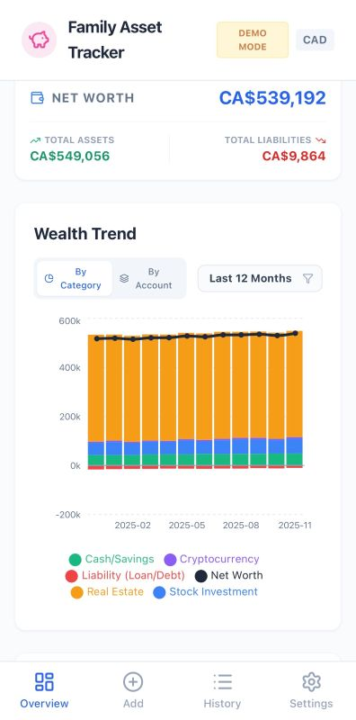

# Family Asset Tracker

A lightweight, installable PWA to track household assets and liabilities. Everything runs in the browser, persists to `localStorage`, and ships with demo data so you can explore immediately.



## Live App
- Vercel: https://family-asset-tracker.vercel.app/

## Features
- Installable PWA with manifest/theme color and home-screen icons; runs fully client-side and keeps working offline with cached assets and local data.
- Dashboard with net worth, asset/liability totals, allocation by category or account, and monthly wealth trend (Recharts).
- Record entry for assets or liabilities with owner/account/category selection, currency choice, and optional notes; demo mode guards destructive actions.
- Manage your lists: create/edit accounts (with currency and category), owners, and color-coded categories (asset/liability, palette or custom color).
- Settings for language (English, Français, 简体中文) and default currency, plus quick navigation to list management.
- Data controls: export CSV, JSON backup/restore (records + accounts/categories/owners), exit demo mode, and clear all data when needed.

## Getting Started
Prerequisites: Node.js 18+

```bash
npm install
npm run dev
```

Open the printed localhost URL. No servers or services are required; data stays in your browser.

### Install on Mobile (PWA)
- Open https://family-asset-tracker.vercel.app/ in Safari (iOS) or Chrome (Android).
- Use **Add to Home Screen**; launch from the icon for a standalone app shell with the stored icons/logo.

## Build for Production
```bash
npm run build
npm run preview   # optional local preview
```
Static assets emit to `dist/`.

## Data & Demo Mode
- First load defaults to demo mode. Exit via **Settings → Exit Demo & Clear Data** to start fresh.
- Personal records persist in `localStorage` keys prefixed with `fat_`.
- CSV exports support spreadsheets; JSON backup/restore includes records, accounts, categories, and owners.

## Tech Stack
- React 19, Vite, TypeScript
- Tailwind (CDN) for styling
- Recharts for visualization
- lucide-react for icons
