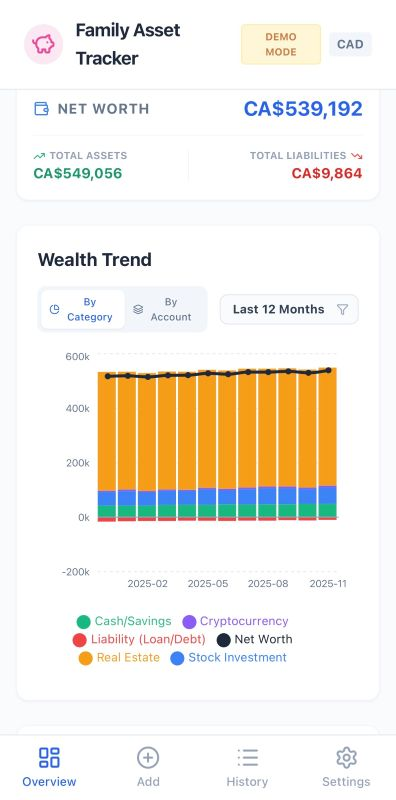

# Family Asset Tracker

A self-hosted PWA to track household assets and liabilities. Data persists in SQLite on your own server; a single access token protects the API.



## Features

- Dashboard with net worth, asset/liability totals, allocation by category or account, and monthly wealth trend.
- Record entry for assets or liabilities with owner/account/category selection, currency choice, and optional notes.
- Manage accounts, owners, and color-coded categories (asset/liability).
- Settings for language (English, Français, 简体中文), default currency, and logo.
- Data controls: export CSV, JSON backup/restore.
- Installable PWA — add to home screen on mobile.

## Architecture

```text
family-asset-tracker/
├── frontend/   # React 19 + Vite + TypeScript
├── backend/    # Python FastAPI + SQLite
├── data/       # SQLite database (gitignored, created at runtime)
└── docker-compose.yml
```

The backend serves the API at `/api/*` and also serves the built frontend static files in production — one process, one port, no reverse proxy needed.

---

## Local Development

### Option A — Docker Compose (recommended)

Prerequisites: Docker with Compose plugin.

```bash
# 1. Create backend env file
cp backend/.env.example backend/.env
#    Edit ACCESS_TOKEN to any strong secret string

# 2. Start both services with hot reload
docker compose up --build
```

- Frontend: <http://localhost:3000>
- Backend API: <http://localhost:8000/api>

The Vite dev server proxies `/api` requests to the backend container automatically. Both services reload on file changes.

To stop:
```bash
docker compose down
```

---

### Option B — Run directly (no Docker)

Prerequisites: Node.js 18+, Python 3.11+.

**Terminal 1 — Backend:**
```bash
cd backend
python -m venv .venv
source .venv/bin/activate        # Windows: .venv\Scripts\activate
pip install -r requirements.txt

cp .env.example .env
# Edit .env: set ACCESS_TOKEN

python -m uvicorn main:app --reload --port 8000
```

**Terminal 2 — Frontend:**
```bash
cd frontend
npm install
npm run dev
```

Open <http://localhost:3000>. The Vite proxy forwards `/api` calls to `http://localhost:8000`.

---

## Production Deployment (Debian/Ubuntu)

Prerequisites: Python 3.11+, Node.js 18+ (build only).

```bash
# 1. Build frontend
cd frontend && npm install && npm run build

# 2. Install backend dependencies
cd ../backend
python3 -m venv .venv
source .venv/bin/activate
pip install -r requirements.txt

# 3. Configure
cp .env.example .env
# Edit .env: ACCESS_TOKEN, DB_PATH, STATIC_DIR=../frontend/dist

# 4. Run (or set up systemd — see backend/asset-tracker.service)
python -m uvicorn main:app --host 0.0.0.0 --port 8000
```

The backend serves both the API and the built frontend from the same port.

---

## Tech Stack

- **Frontend:** React 19, Vite, TypeScript, Recharts, lucide-react, Tailwind (CDN)
- **Backend:** Python FastAPI, SQLite (stdlib), uvicorn
- **Auth:** Single Bearer token set in `.env`
